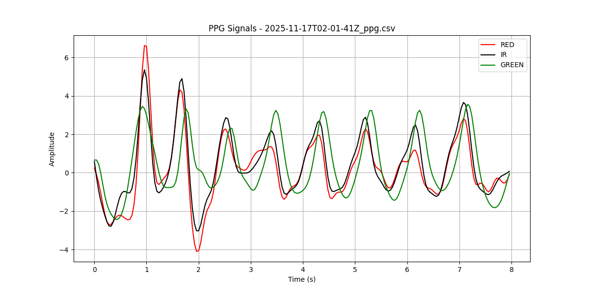

# Atributos Derivados PPG

## Objetivo

Este proyecto tiene como objetivo procesar y analizar señales fisiológicas, específicamente fotopletismografía (PPG), para calcular y derivar atributos relevantes como la frecuencia cardíaca, apoyando el análisis de datos biomédicos.

## Estructura del Proyecto

El repositorio está organizado de la siguiente manera:

```text
.
├── data/
│   ├── input/       # Carpeta para los archivos CSV de entrada con señales PPG
│   └── output/      # Carpeta donde se guardan los resultados derivados
├── src/
│   ├── cardiac_freq.py  # Módulo con la lógica para el cálculo de la frecuencia cardíaca
│   ├── common.py        # Funciones auxiliares y utilidades comunes
│   └── config.py        # Parámetros de configuración del proyecto
├── main.py          # Script principal que orquesta la ejecución
└── requirements.txt # Lista de dependencias de Python necesarias
```

## Formato de Datos

Los datos deben estar en formato tabular **CSV**.

- Los archivos en `data/input/` en su estructura deben contener características de la señal a procesar (ej. datos crudos PPG).

  `data/input/2025-11-17T02-01-41Z_ppg.csv`:

  | | RED | IR | GREEN |
  | --- | --- | --- | --- |
  | 1763344895168 | 914855 | 1294302 | 17511 |
  | 1763344895208 | 914928 | 1294175 | 17778 |
  | 1763344895248 | 914959 | 1293861 | 17875 |
  | ... | ... | ... | ... |

- Los resultados de `data/output/` conservarán un nombre correspondiente al archivo original procesado con las derivaciones computadas añadidas.

  `data/output/2025-11-17T02-01-41Z_ppg.csv`:

  | Column | Heart Rate (BPM) | Frequency Variability (s) | Tachycardic |
  | --- | --- | --- | --- |
  | RED | 95.36423841059602 | 0.14535636285427006 | False |
  | IR | 103.06748466257667 | 0.04374088826398532 | True |
  | GREEN | 107.69230769230771 | 0.025753937681885615 | True |

  El plot generado se guardará con el mismo nombre pero con extensión `.png`:

  `data/output/2025-11-17T02-01-41Z_ppg.png`:

  

## Instalación y Configuración (Setup)

1. **Clonar** el repositorio (si aplica) y entrar al directorio del proyecto.
2. **Crear un entorno virtual** (recomendado):

   ```bash
   python -m venv .venv
   source .venv/bin/activate  # En Linux/Mac
   ```

3. **Instalar dependencias**:

   ```bash
   pip install -r requirements.txt
   ```

## Uso

1. Colocar el archivo de muestras PPG en la carpeta `data/input/` (ejemplo: `2025-11-17T02-01-41Z_ppg.csv`).
2. Ejecutar el script principal:

   ```bash
   python -m main 2025-11-17T02-01-41Z_ppg.csv
   ```

3. Los resultados derivados se guardarán automáticamente en `data/output/`, los atributos con el mismo nombre del archivo original, y el plot con el mismo nombre pero con extensión `.png`.
